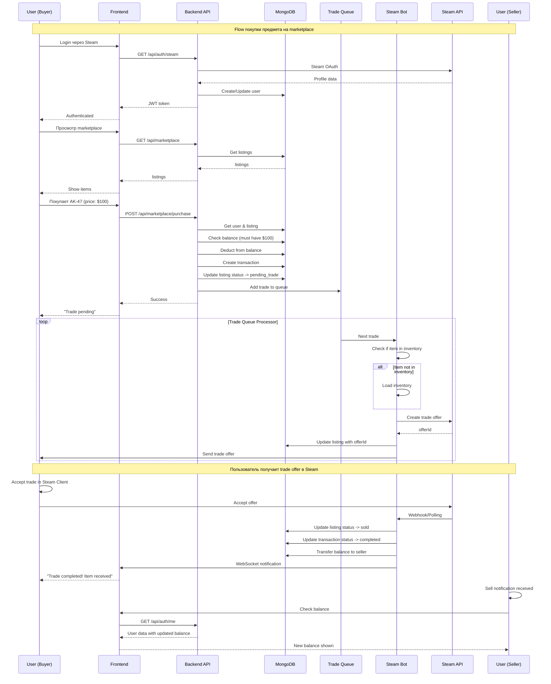

# 🎮 АРХИТЕКТУРА STEAM ИНТЕГРАЦИИ

**Дата:** 2025-11-07
**Версия:** 2.0.0

---

## 📊 ОБЗОР СИСТЕМЫ

Steam интеграция в вашем проекте построена на **трёх основных компонентах:**

```
1. 🔐 Steam OAuth - Аутентификация пользователей
2. 🤖 Steam Bots - Автоматизация trade offers
3. 📦 Inventory API - Загрузка и управление предметами
```

---

## 🔄 ПОЛНЫЙ FLOW ПОКУПКИ ПРЕДМЕТА

### Шаг 1: Пользователь аутентифицируется через Steam
```
User → Steam OAuth → Callback → JWT Token → Frontend
```

**Детали:**
1. Пользователь нажимает "Войти через Steam"
2. Приложение перенаправляет на `https://steamcommunity.com/openid`
3. Steam возвращает профиль пользователя
4. Сервер создаёт JWT токен (7 дней)
5. Пользователь перенаправляется в frontend с токеном
6. OAuth access token сохраняется в профиле пользователя

---

### Шаг 2: Пользователь загружает свой инвентарь
```
Frontend → GET /api/steam/inventory → Steam API → Cache → Response
```

**Кэширование:**
- TTL: 5 минут
- Ключ кэша: `inventory_{steamId}_{appId}`
- Fallback: демо данные из БД

---

### Шаг 3: Пользователь создаёт объявление
```
Frontend → POST /api/marketplace → DB → Listing Created
```

**Валидация:**
- Проверка владения предметом
- Проверка trade URL
- Проверка tradable статуса

---

### Шаг 4: Другой пользователь покупает предмет
```
Buyer → POST /api/marketplace/purchase → Balance Check → Queue Trade
```

**Процесс покупки:**
1. Списание средств с баланса покупателя
2. Создание записи о транзакции
3. Добавление trade в очередь
4. Обновление статуса listing'а на `pending_trade`

---

### Шаг 5: Trade Bot обрабатывает trade offer
```
Queue → Bot Manager → Select Bot → Create Offer → Steam API
```

**Алгоритм выбора бота:**
1. Фильтр активных ботов
2. Проверка наличия предмета в инвентаре
3. Выбор бота с минимальным количеством активных trades
4. Создание trade offer через Steam API

---

### Шаг 6: Покупатель принимает trade offer
```
User → Steam Client → Accept Offer → Steam API → Webhook → Update Status
```

**Статусы listing'а:**
- `active` → объявление активно
- `pending_trade` → trade offer создан
- `sold` → trade принят
- `cancelled` → отменён

---

## 🏗️ АРХИТЕКТУРНЫЕ КОМПОНЕНТЫ

### 1. 🔐 Steam OAuth Authentication

**Файлы:**
- `routes/auth.js` - Steam OAuth endpoints
- `passport-steam` - стратегия аутентификации
- `models/User.js` - профиль пользователя

**Endpoints:**
```javascript
GET /api/auth/steam           // Начало OAuth flow
GET /api/auth/steam/return    // OAuth callback
GET /api/auth/me              // Получить профиль
POST /api/auth/logout         // Выйти
POST /api/auth/test-user      // Test token (dev only)
```

**Конфигурация Passport:**
```javascript
new SteamStrategy({
  returnURL: `${process.env.BASE_URL}/api/auth/steam/return`,
  realm: process.env.BASE_URL,
  apiKey: process.env.STEAM_API_KEY
})
```

**Особенности:**
- ✅ Сохранение OAuth access token в профиле
- ✅ Первый пользователь автоматически становится админом
- ✅ Обновление данных пользователя при каждом входе
- ✅ JWT токен на 7 дней

---

### 2. 🤖 Steam Bot System

**Файлы:**
- `services/steamBot.js` - отдельный бот
- `services/steamBotManager.js` - управление множественными ботами

#### SteamBot (Отдельный бот)

**Возможности:**
- 🔑 Автоматическая авторизация (Steam Guard TOTP)
- 📦 Загрузка инвентаря (CS2, Dota 2)
- 🔄 Автоматическое переподключение
- 💰 Создание trade offers
- 📊 Мониторинг статуса
- ⚖️ Load balancing (активных trades)

**Event Handlers:**
```javascript
'steamGuard'      // Авто-генерация кода
'loggedOn'        // Успешный вход
'disconnected'    // Переподключение
'inventoryLoaded' // Загрузка инвентаря
'newOffer'        // Входящий trade offer
'offerList'       // Статус trade offer
```

**Конфигурация:**
```javascript
// SteamUser
{
  promptSteamGuardCode: false,
  disableScheduledMessages: false
}

// TradeOfferManager
{
  language: 'en',
  pollInterval: 10000,    // 10 seconds
  cancelTime: 15 * 60 * 1000 // 15 minutes
}
```

**Статусы бота:**
- `isOnline` - подключён к Steam
- `isAvailable` - готов принимать trades
- `currentTrades` - количество активных trades
- `inventory` - массив предметов

#### SteamBotManager (Управление ботами)

**Возможности:**
- 🔢 Поддержка множественных ботов
- ⚖️ Load balancing
- 🔄 Автоматический реконнект
- 📋 Trade queue system
- 🔍 Health monitoring

**Алгоритмы:**

**1. Выбор бота (getAvailableBot):**
```javascript
1. Фильтр активных и доступных ботов
2. Исключение ботов с полной очередью
3. Сортировка по количеству активных trades
4. Возврат бота с минимальной нагрузкой
```

**2. Trade Queue:**
```javascript
FIFO (First In, First Out)
Max size: 100 trades
Retry attempts: 3
Exponential backoff: 1s * 2^attempt
```

**3. Инициализация ботов:**
```javascript
Общая задержка: 30 секунд
Между ботами: 30 секунд
Цель: Избежать Steam rate limiting
```

---

### 3. 📦 Inventory Management

**Файлы:**
- `services/steamIntegrationService.js` - работа с Steam API
- `routes/steam.js` - API endpoints

#### Получение инвентаря пользователя

**Источники данных:**
1. **Steam Community API** (Primary)
   - URL: `https://steamcommunity.com/inventory/{steamId}/{appId}/2`
   - Требует: OAuth access token
   - Кэш: 5 минут

2. **Демо данные из БД** (Fallback)
   - Хранится в `user.userInventory`
   - Используется, если нет OAuth token

**Фильтрация предметов:**
```javascript
✅ tradable === true
✅ marketable === true
✅ type не содержит:
   - "Base Grade Container"
   - "Graffiti"
   - "Music"
```

**Кэширование:**
```javascript
const cacheKey = `inventory_${steamId}_${appId}`;
const CACHE_TTL = 5 * 60 * 1000; // 5 минут
```

#### Получение инвентаря бота

**Способы:**
1. **TradeOfferManager.inventory** (Primary)
   - Автоматически загружается TradeOfferManager
   - Самое быстрое

2. **Steam Community API** (Fallback)
   - Используется, если TradeOfferManager не готов
   - Таймаут: 30 секунд

**Retry механизм:**
```javascript
Макс. попыток: 5
Задержка между попытками: 10 секунд
Автозапуск: через 30 секунд после инициализации
```

---

### 4. 💱 Trade Offer System

**Файлы:**
- `routes/trade.js` - Trade endpoints
- `services/tradeOfferService.js` - Trade логика

#### Создание Trade Offer

**Типы Trade Offers:**

**1. Sell Offer (покупка с баланса)**
```javascript
// От бота к пользователю
myAssetIds: [assetId_from_bot]    // Предмет из бота
theirAssetIds: []                  // Ничего от пользователя
message: "Marketplace transaction"
```

**2. Buy Offer (покупка за предметы)**
```javascript
// От пользователя к боту
myAssetIds: [assetId_from_user]   // Предмет от пользователя
theirAssetIds: []                  // Ничего от бота
```

**3. Exchange Offer (обмен)**
```javascript
myAssetIds: [...]                  // Предметы бота
theirAssetIds: [...]               // Предметы пользователя
```

**Процесс создания:**
```javascript
1. Валидация assetIds
2. Поиск предметов в инвентаре
3. Создание offer через TradeOfferManager
4. Добавление предметов (addMyItem/addTheirItem)
5. Отправка offer (offer.send)
6. Сохранение offer ID в listing
```

#### Валидация Trade URL

**Проверки:**
- ✅ Trade URL принадлежит пользователю
- ✅ URL валиден и доступен
- ✅ Trade URL актуален (не старше 30 дней)

---

### 5. 🔌 WebSocket (Real-time уведомления)

**Файлы:**
- `app.js` - Socket.io сервер

**События:**
```javascript
// Инициализация
socket.emit('init', { userId, bots: [...] });

// Trade события
socket.emit('trade:created', { offerId, listingId });
socket.emit('trade:accepted', { offerId });
socket.emit('trade:declined', { offerId });
socket.emit('trade:cancelled', { offerId });

// Статус бота
socket.emit('bot:status', { botId, status });
socket.emit('bot:inventory', { botId, count });
```

**Клиент (Frontend):**
```javascript
socket.on('trade:created', (data) => {
  // Обновить UI
  showNotification(`Trade created: ${data.offerId}`);
});
```

---

## 🔧 КОНФИГУРАЦИЯ

### Environment Variables

```bash
# Обязательные
STEAM_API_KEY=your_steam_api_key
STEAM_BOT_1_USERNAME=bot_username
STEAM_BOT_1_PASSWORD=bot_password
STEAM_BOT_1_SHARED_SECRET=base64_secret
STEAM_BOT_1_IDENTITY_SECRET=base64_secret

# Опциональные (для множественных ботов)
STEAM_BOT_2_USERNAME=...
STEAM_BOT_2_PASSWORD=...
STEAM_BOT_2_SHARED_SECRET=...
STEAM_BOT_2_IDENTITY_SECRET=...
```

### Steam API Key

**Как получить:**
1. Перейти на https://steamcommunity.com/dev/apikey
2. Войти в Steam аккаунт
3. Зарегистрировать API key
4. Домен: `your-domain.com`

---

## 📊 ДИАГРАММА АРХИТЕКТУРЫ

```
┌─────────────────────────────────────────────────────────────────┐
│                        FRONTEND (React)                          │
│  ┌──────────────┐  ┌──────────────┐  ┌──────────────┐            │
│  │   Auth UI    │  │  Inventory   │  │   Market     │            │
│  │   (Steam)    │  │     UI       │  │     UI       │            │
│  └──────────────┘  └──────────────┘  └──────────────┘            │
└────────────────────┬──────────────────────────────────────────────┘
                     │ HTTP/WebSocket
┌────────────────────▼──────────────────────────────────────────────┐
│                      BACKEND (Node.js)                             │
│                                                                     │
│  ┌──────────────┐  ┌──────────────┐  ┌──────────────┐            │
│  │   Auth API   │  │  Steam API   │  │ Marketplace  │            │
│  │  (routes)    │  │   (routes)   │  │   (routes)   │            │
│  └──────┬───────┘  └──────┬───────┘  └──────┬───────┘            │
│         │                 │                   │                    │
│  ┌──────▼───────┐  ┌──────▼───────┐  ┌──────▼───────┐            │
│  │ Passport     │  │ Steam        │  │ Trade Offer  │            │
│  │ Steam        │  │ Integration  │  │ Service      │            │
│  │ Strategy     │  │ Service      │  │              │            │
│  └──────┬───────┘  └──────┬───────┘  └──────┬───────┘            │
│         │                 │                   │                    │
│  ┌──────▼───────┐  ┌──────▼───────┐  ┌──────▼───────┐            │
│  │ User Model   │  │ Steam Bot    │  │ Market       │            │
│  │ (MongoDB)    │  │ Manager      │  │ Model        │            │
│  └──────┬───────┘  └──────┬───────┘  └──────┬───────┘            │
│         │                 │                   │                    │
│  ┌──────▼───────┐  ┌──────▼───────┐  ┌──────▼───────┐            │
│  │   JWT        │  │ Steam Bot    │  │ Steam        │            │
│  │   Tokens     │  │ 1...N        │  │ Community    │            │
│  └──────────────┘  └──────┬───────┘  └──────┬───────┘            │
│                          │                   │                    │
│                    ┌─────▼─────┐       ┌─────▼─────┐            │
│                    │ Trade     │       │ Steam     │            │
│                    │ Queue     │       │ API       │            │
│                    └───────────┘       └───────────┘            │
│                                                                     │
└─────────────────────────────────────────────────────────────────────┘
                                    │ Steam API
                                    │
    ┌───────────────────────────────┼───────────────────────────────┐
    │                               │                               │
┌───▼──────────┐          ┌────────▼────────┐             ┌─▼────────┐
│ Steam OAuth  │          │ Trade Offer     │             │ Inventory│
│ Service      │          │ Manager (Bot)   │             │ API      │
└──────────────┘          └────────┬────────┘             └──────────┘
                                   │ Steam Trade
                                   │
    ┌──────────────────────────────┼──────────────────────────────┐
    │                              │                              │
┌───▼──────────┐          ┌───────▼──────┐             ┌─▼────────┐
│ Steam Bot    │          │ Trade Offer  │             │ Market   │
│ Account 1    │          │ Queue        │             │ Prices   │
└──────────────┘          └──────────────┘             └──────────┘

                      (Возможно несколько ботов)
```

---

## 🔄 ДЕТАЛЬНЫЙ FLOW ПРОЦЕССА ПОКУПКИ

### Сценарий: Пользователь покупает AK-47 Redline



---

## 🛡️ БЕЗОПАСНОСТЬ

### 1. Steam Guard
- **TOTP**: Автоматическая генерация кодов через `steam-totp`
- **Shared Secret**: Хранится в конфигурации бота
- **Identity Secret**: Для trade confirmation

### 2. OAuth Tokens
- **Хранение**: В профиле пользователя (`user.steamAccessToken`)
- **Использование**: Доступ к приватному инвентарю
- **Безопасность**: Токен не выводится в API

### 3. Trade URL Validation
- Проверка принадлежности пользователю
- Валидация формата
- Проверка актуальности

### 4. Trade Limits
- **Максимум 5 одновременных trades** на бота
- **15 минут** - время жизни trade offer
- **Rate limiting** - 100 запросов / 15 минут

---

## 📈 МОНИТОРИНГ

### Health Checks
```javascript
// Bot status
{
  id: 'bot_0',
  isConnected: true,
  isAvailable: true,
  currentTrades: 2,
  inventoryCount: 150
}
```

### Sentry Integration
- Отслеживание ошибок Steam API
- Мониторинг trade failures
- Alert'ы на disconnections

### Логирование
```javascript
// Winston logger
[bot_0] Logged in as: my_bot
[bot_0] Trade offer 123456789 created
[bot_0] Item AK-47 | Redline not found in inventory
```

---

## ⚠️ ИЗВЕСТНЫЕ ОГРАНИЧЕНИЯ

### 1. Steam API
- **Rate Limiting**: Не более 100 запросов в секунду
- **Private Inventories**: Требуют OAuth токен
- **Community Market**: Цены могут быть устаревшими

### 2. Trade Offers
- **Время жизни**: 15 минут
- **Максимум 5 одновременных** на аккаунт
- **Не все предметы** tradable

### 3. Inventory
- **Кэш**: 5 минут (может быть устаревшим)
- **Только CS2 & Dota 2**: Поддерживаемые игры

---

## 🔧 TROUBLESHOOTING

### Бот не может войти
```bash
# Проверить
1. Правильность username/password
2. Steam Guard код
3. Shared/Identity secret
4. Аккаунт не заблокирован
```

### Trade offer не создаётся
```bash
# Проверить
1. Предмет в инвентаре бота
2. Предмет tradable
3. У пользователя корректный trade URL
4. Не превышен лимит trades
```

### Инвентарь не загружается
```bash
# Проверить
1. OAuth токен валиден
2. Инвентарь публичный или есть токен
3. Steam API доступен
4. Rate limit не превышен
```

---

## 📚 ЗАКЛЮЧЕНИЕ

### Что работает хорошо:
✅ **Steam OAuth** - полная интеграция
✅ **Multi-bot система** - масштабируемость
✅ **Trade automation** - автообработка
✅ **Inventory caching** - производительность
✅ **Real-time updates** - WebSocket
✅ **Error handling** - Sentry + логи
✅ **Security** - Steam Guard + OAuth

### Возможные улучшения:
- ⚡ **Redis кэш** для инвентаря
- 📊 **Детальная аналитика** trades
- 🔍 **Fraud detection** система
- 📱 **Mobile app** интеграция
- 💬 **Telegram bot** для уведомлений

---

*Документ создан: 2025-11-07*
*Версия: 2.0.0*
